# Multi-Game Mode Architecture

## Executive Summary

This document outlines the architectural evolution of the LAG Secret Assassin platform to support multiple game modes with Uber-like real-time tracking features. The design maintains the existing serverless foundation while adding extensible game mode frameworks and enhanced real-time capabilities.

## Architecture Goals

### Core Objectives
- **Game Mode Extensibility**: Support for unlimited game types
- **Real-time Experience**: Uber-like tracking with <500ms latency
- **Horizontal Scaling**: Support 1000+ concurrent players per game mode
- **Modular Design**: Independent game mode deployment and updates
- **Discovery System**: Netflix-like game browsing experience

### Non-Functional Requirements
- **Latency**: <500ms for location updates, <200ms for game actions
- **Availability**: 99.9% uptime across all game modes
- **Scalability**: Auto-scaling from 10 to 10,000 concurrent players
- **Security**: Zero-trust architecture with end-to-end encryption
- **Cost Efficiency**: Pay-per-use serverless model

## High-Level Architecture

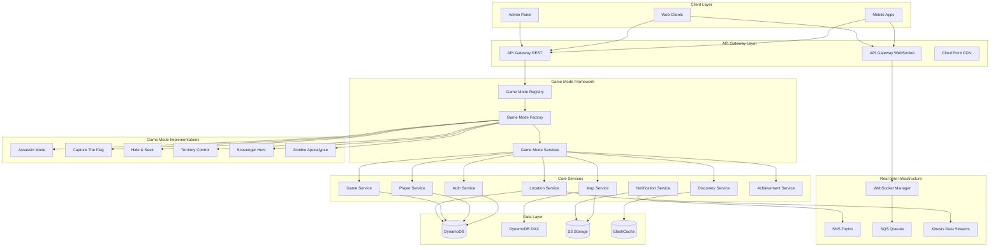

## Game Mode Framework Architecture

### Core Components

#### 1. Game Mode Registry
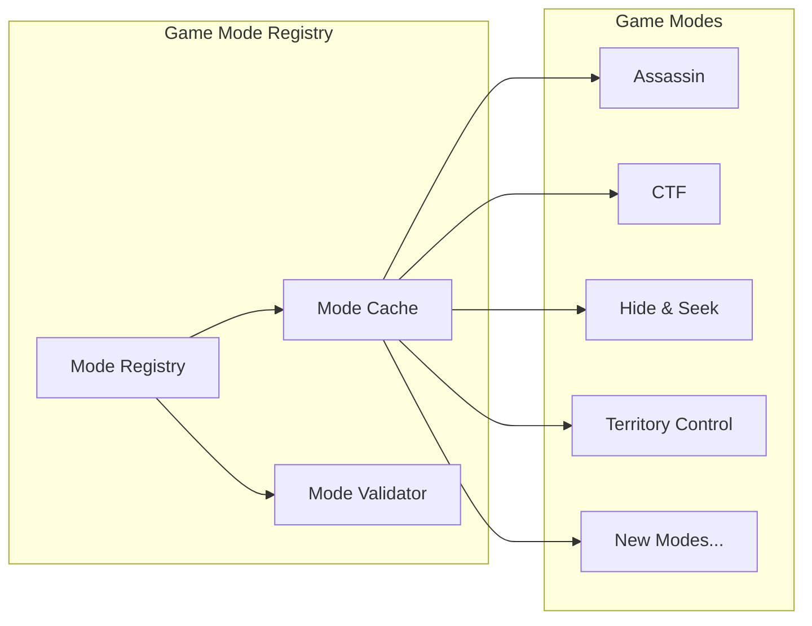

**Responsibilities:**
- Game mode discovery and registration
- Mode validation and configuration
- Dynamic loading of new game modes
- Performance caching of mode metadata

#### 2. Game Mode Interface
```java
interface GameMode {
    String getModeId();
    String getModeName();
    GameConfiguration getDefaultConfiguration();
    void initializeGame(Game game);
    void onPlayerJoin(Game game, Player player);
    void onLocationUpdate(Game game, Player player, Location location);
    GameEndResult checkEndConditions(Game game);
    Map<String, Object> getGameState(Game game);
    List<PlayerAction> getAvailableActions(Game game, Player player);
    MapConfiguration getMapConfiguration(Game game);
}
```

#### 3. Real-time Map Service
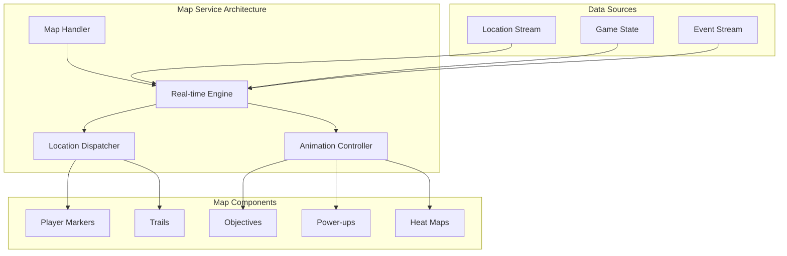

## Service Boundaries

### 1. Game Mode Services
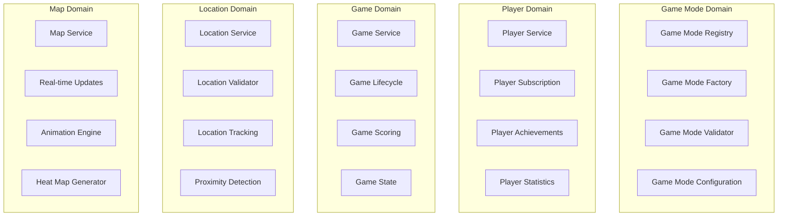

### 2. Data Flow Patterns

#### Real-time Location Updates
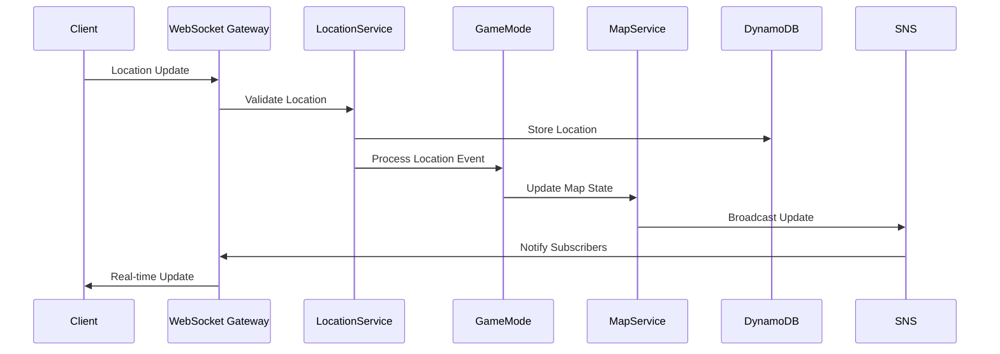

#### Game Mode State Management
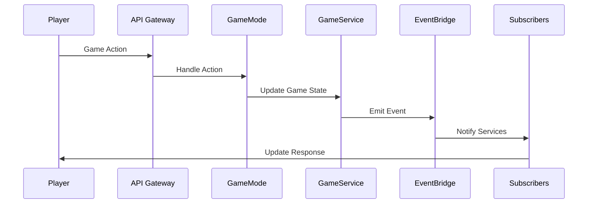

## Enhanced Components

### 1. Discovery Service Architecture
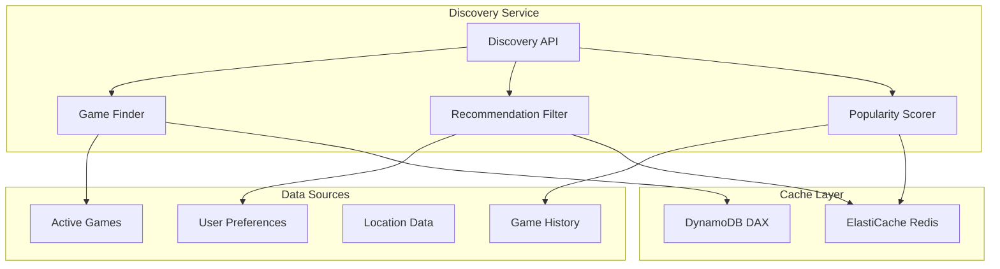

### 2. Power-up System
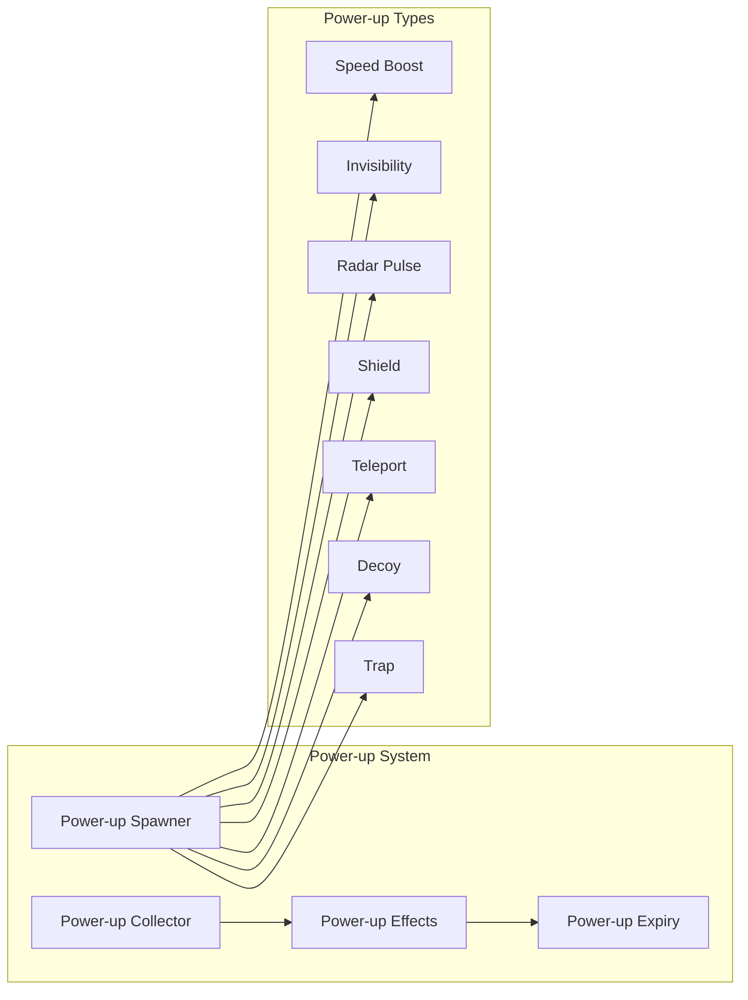

### 3. Achievement System
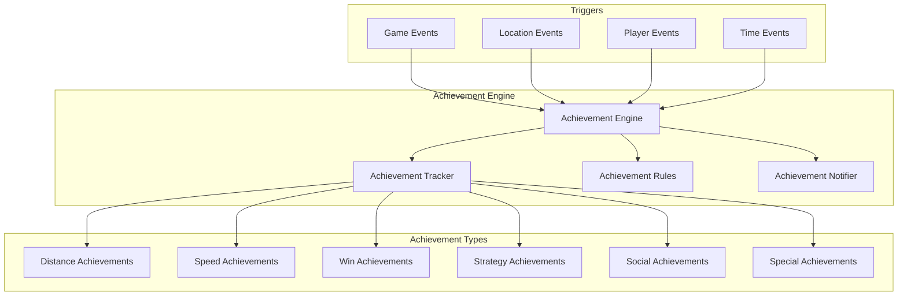

## Data Architecture

### 1. DynamoDB Table Design
```
Tables:
├── Games                    # Game instances and configuration
│   ├── PK: GameId
│   ├── SK: Metadata
│   ├── GSI1: Status-CreatedAt (discovery)
│   └── GSI2: Mode-CreatedAt (mode filtering)
│
├── Players                  # Player profiles and state
│   ├── PK: PlayerId
│   ├── SK: Metadata
│   ├── GSI1: Email (auth lookup)
│   └── GSI2: Game-Status (active players)
│
├── GameModeConfigs         # Game mode configurations
│   ├── PK: ModeId
│   ├── SK: Version
│   └── GSI1: Status-Priority (active modes)
│
├── GameStates              # Real-time game state
│   ├── PK: GameId
│   ├── SK: StateType#Timestamp
│   └── TTL: Auto-expire old states
│
├── Locations               # Player location history
│   ├── PK: PlayerId
│   ├── SK: Timestamp
│   ├── GSI1: GameId-Timestamp (game tracking)
│   └── TTL: Auto-expire old locations
│
├── Achievements            # Player achievements
│   ├── PK: PlayerId
│   ├── SK: AchievementId
│   └── GSI1: Type-UnlockedAt (leaderboards)
│
└── PowerUps               # Active power-ups
    ├── PK: GameId
    ├── SK: PowerUpId
    ├── GSI1: Type-SpawnedAt (collection)
    └── TTL: Auto-expire
```

### 2. Caching Strategy
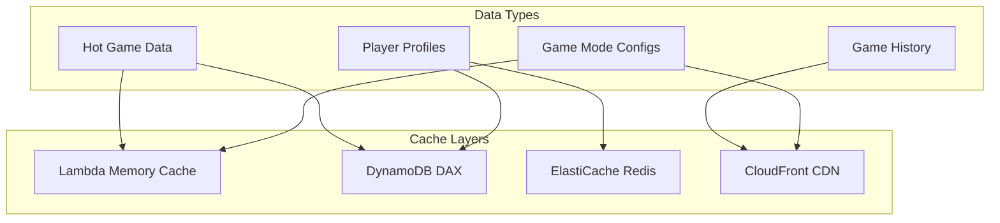

## API Design

### 1. Game Mode APIs
```yaml
# Game Mode Discovery
GET /game-modes
GET /game-modes/{modeId}
GET /game-modes/{modeId}/configuration

# Game Creation with Mode
POST /games
{
  "mode": "capture_the_flag",
  "configuration": {
    "scoreLimit": 3,
    "teamSize": 5,
    "flagRespawnTime": 30
  }
}

# Mode-specific Actions
POST /games/{gameId}/actions/{actionType}
{
  "playerId": "player123",
  "parameters": {
    "targetPlayerId": "player456",
    "location": {"lat": 40.7128, "lng": -74.0060}
  }
}

# Real-time Game State
GET /games/{gameId}/state
WebSocket: /games/{gameId}/live
```

### 2. Discovery APIs
```yaml
# Nearby Games
GET /discovery/games/nearby
  ?lat=40.7128&lng=-74.0060&radius=5000
  &modes=assassin,ctf&maxPlayers=50

# Popular Games
GET /discovery/games/popular
  ?timeframe=24h&mode=all

# Recommended Games
GET /discovery/games/recommended
  ?playerId=player123&count=10

# Join Game
POST /discovery/games/{gameId}/join
{
  "playerId": "player123",
  "preferences": {
    "team": "auto",
    "role": "any"
  }
}
```

## Deployment Strategy

### 1. Microservice Deployment
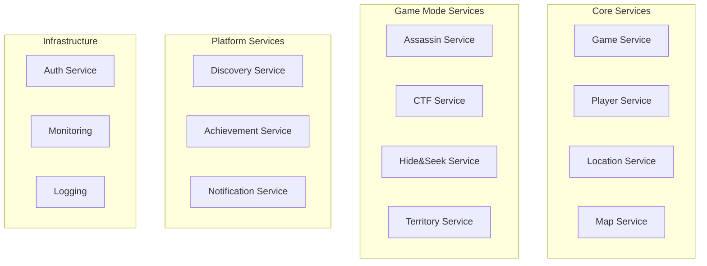

### 2. Blue-Green Deployment
```yaml
Deployment Strategy:
  Core Services:
    - Rolling updates with health checks
    - Canary releases for major changes
    - Rollback capability within 30 seconds
    
  Game Mode Services:
    - Independent deployment per mode
    - A/B testing for new features
    - Feature flags for gradual rollout
    
  Infrastructure:
    - Immutable infrastructure updates
    - Cross-region redundancy
    - Disaster recovery automation
```

## Monitoring and Observability

### 1. Metrics Dashboard
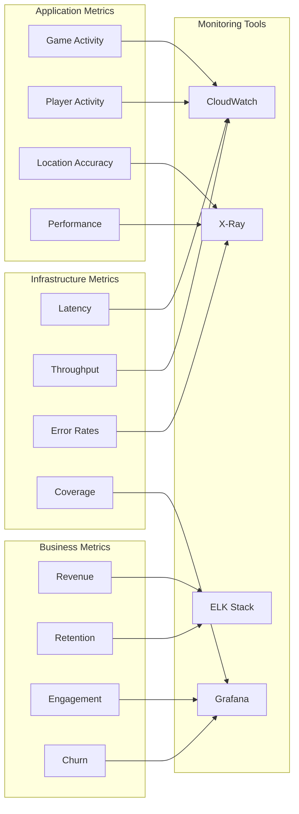

### 2. Alerting Strategy
```yaml
Critical Alerts (PagerDuty):
  - API Gateway 5xx > 1%
  - Lambda cold start > 5s
  - DynamoDB throttling
  - WebSocket connection failures

Warning Alerts (Slack):
  - Response time > 1s
  - Game completion rate < 80%
  - Player join failure > 5%

Info Alerts (Dashboard):
  - New game mode adoption
  - Regional usage patterns
  - Performance trends
```

## Security Architecture

### 1. Zero-Trust Security Model
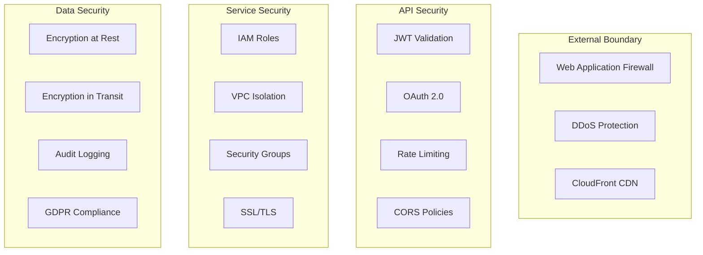

### 2. Game-Specific Security
```yaml
Anti-Cheat Measures:
  Location Validation:
    - GPS accuracy thresholds
    - Speed limit validation
    - Geofencing verification
    - Pattern analysis
    
  Game Action Validation:
    - Action frequency limits
    - Context validation
    - Player state verification
    - Timeline consistency
    
  Real-time Monitoring:
    - Anomaly detection
    - Behavior analysis
    - Automated responses
    - Manual review queue
```

## Scalability Considerations

### 1. Auto-Scaling Configuration
```yaml
Lambda Functions:
  Reserved Concurrency: 1000 per function
  Burst Concurrency: 3000 system-wide
  Cold Start Optimization: <500ms
  
DynamoDB:
  On-Demand Scaling: Enabled
  Auto-Scaling Targets: 70% utilization
  Burst Capacity: 300 seconds
  
API Gateway:
  Throttling: 10,000 requests/second
  Burst: 5,000 requests
  Caching: 5-minute TTL
```

### 2. Performance Targets
```yaml
Response Times:
  API Endpoints: <200ms (p95)
  Location Updates: <500ms (p99)
  WebSocket Messages: <100ms (p95)
  Game State Queries: <150ms (p95)

Throughput:
  Concurrent Players: 10,000 per region
  Location Updates: 100,000/second
  Game Actions: 50,000/second
  WebSocket Connections: 50,000 concurrent

Availability:
  API Gateway: 99.9%
  Lambda Functions: 99.95%
  DynamoDB: 99.999%
  Overall System: 99.9%
```

## Migration Strategy

### Phase 1: Foundation (2-3 weeks)
- Implement Game Mode Framework
- Create abstract interfaces
- Update existing Assassin mode
- Deploy registry service

### Phase 2: Core Modes (4-6 weeks)
- Implement Capture The Flag
- Implement Hide & Seek
- Deploy enhanced map service
- Add power-up system

### Phase 3: Discovery & Features (3-4 weeks)
- Deploy discovery service
- Implement achievement system
- Add advanced analytics
- Performance optimization

### Phase 4: Advanced Modes (4-6 weeks)
- Territory Control mode
- Scavenger Hunt mode
- Zombie Apocalypse mode
- Custom game creation

## Conclusion

This architecture design provides a robust, scalable foundation for the multi-game-mode LAG platform while maintaining security, performance, and cost efficiency. The modular design enables rapid development of new game modes and features while ensuring system reliability and user experience quality.

The serverless-first approach with AWS Lambda and DynamoDB provides automatic scaling and cost optimization, while the game mode framework ensures extensibility and maintainability of the platform as it grows.